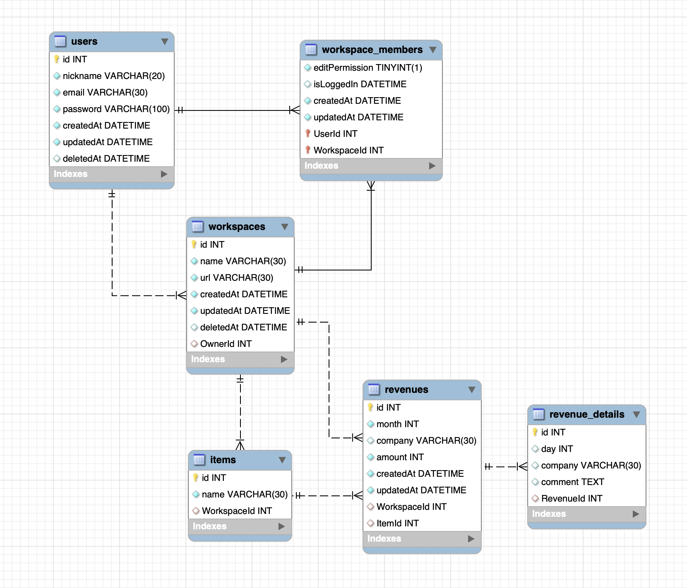
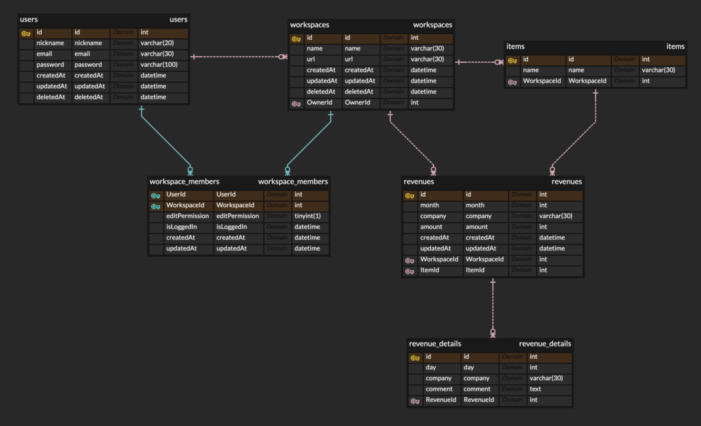

```bash
- 사용자
PK    사용자id
      이름
      닉네임
      이메일
      PW

- 워크스페이스_멤버
PK FK 사용자id
PK FK 워크스페이스id
      수정권한

- 워크스페이스
PK    워크스페이스id
   FK 오너id
      이름
      url

- 품목
PK    품목id
   FK 워크스페이스id
      이름

- 매출
PK    매출id
      월
      회사
      금액
   FK 워크스페이스id
   FK 품목id

- 매출상세
PK FK 매출id
      일
      비고

- 매출상세
매출상세id
매출id
일
비고 comment
```


* 매출 상세에 회사가 있는 건 오류임